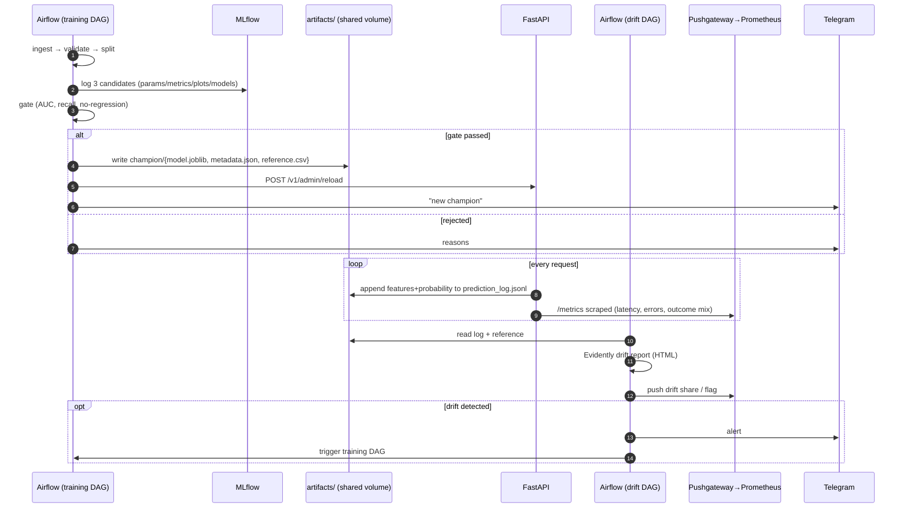

# System Architecture

## 1. Components and responsibilities

| Component | Responsibility | Tech |
|---|---|---|
| Data layer | Download, clean, validate (schema, ranges, categories, duplicates, churn-rate sanity), stratified split | pandas, `churn.data` |
| Feature layer | Domain features (`avg_monthly_spend`, `n_services`, `tenure_group`, `is_month_to_month`, …) *inside* the sklearn Pipeline ⇒ identical at train and serve time | scikit-learn |
| Training | 3 candidates (LogReg, RandomForest, XGBoost), `RandomizedSearchCV` with 5-fold stratified CV, class-imbalance handling, nested MLflow runs (params, metrics, ROC/CM plots, model) + Model Registry | MLflow |
| Validation gate | Absolute floor (AUC ≥ 0.78, recall ≥ 0.55) **and** non-regression vs. champion (−0.01) before promotion | `churn.evaluate` |
| Serving | FastAPI, versioned routes, Pydantic validation, SHAP explanations, hot-reload, Prometheus metrics, prediction log | FastAPI, uvicorn |
| Orchestration | DAG 1 training pipeline (weekly/on-demand); DAG 2 hourly drift monitoring that can trigger DAG 1 | Airflow 2.9 |
| Drift | Evidently `DataDriftPreset` on features + prediction (`churn_probability`) vs. champion reference | Evidently |
| Monitoring | Metrics, 10 alert rules, Grafana dashboard (14 panels) | Prometheus, Pushgateway, Grafana |
| Alerting | Alertmanager → Telegram; Airflow/Evidently/CD → Telegram via `churn.notify` | Telegram Bot API |
| Responsible AI | Fairlearn audit + mitigation, SHAP (global/local), LIME (local) | Fairlearn, SHAP, LIME |
| Object Storage | MinIO (S3-compatible) for MLflow artifacts (`s3://mlflow`), data (`s3://churn-data`), reports (`s3://churn-reports`), and model artifacts (`s3://churn-artifacts`) | MinIO (`bitnamilegacy/minio`) |
| CI/CD | CI: lint, types, tests, DAG import, manifest validation, image smoke test. CD: build/push image, bump manifest; ArgoCD reconciles | GitHub Actions, ArgoCD, Kustomize |

## 2. Data flow

### Edge cases handled
* Blank `TotalCharges` for brand-new customers → imputed with 0 (tenure 0).
* Unseen categories at inference → `OneHotEncoder(handle_unknown="ignore")`; unknown enum values rejected at the API (422).
* Model missing/corrupt at start → API stays up, `/ready` = 503, alert `ModelNotLoaded`.
* Drift check with < 100 logged requests → skipped (no false alarms); Pushgateway down → warning only.
* Telegram down / unconfigured → never breaks the pipeline (`send_telegram` never raises).
* Atomic champion swap (copy to `.tmp` then rename) so the API never reads a half-written model.
* Concurrent writes to the prediction log are serialised with a lock.

## 3. Technology decisions and trade-offs

| Decision | Alternatives | Why / trade-off |
|---|---|---|
| **Airflow with a separate venv for ML deps** (`BashOperator` → CLI) | `PythonVirtualenvOperator`, KubernetesPodOperator, Prefect | Avoids Airflow constraint conflicts (pandas/pydantic). Cost: image bigger; tasks communicate through files, not XCom. Prod: KubernetesPodOperator + object storage. |
| **LocalExecutor + Postgres** in Compose | Celery/K8s executor | Enough for 1 weekly + 1 hourly DAG, low complexity. Not horizontally scalable. |
| **Evidently 0.4.x** pinned | 0.7+ new API, NannyML | Stable `Report/Preset` API with HTML output for demos; pin avoids silent API breaks. No labels in production ⇒ only data/prediction drift (no performance drift until labels arrive). |
| **Push drift metrics via Pushgateway** | Evidently monitoring UI, exporter service | Batch job ⇒ push model is the Prometheus-recommended pattern; metrics join the same dashboard/alerts. Caveat: stale series if the job stops → `DriftMonitorStale` alert. |
| **Alertmanager native Telegram receiver** + `notify.py` for pipeline events | Custom relay bot | Native receiver = no extra service; `notify.py` is needed only for events Prometheus cannot see (DAG failures, promotions). |
| **Model baked into the image (K8s)**, volume mount (Compose) | Load from MLflow registry at start | Immutable, reproducible deployments & instant rollback via git; downside: a retrain ⇒ new image. Compose keeps hot-reload for the demo. |
| **File-based prediction log** | Kafka / Postgres | Simplest thing that feeds Evidently; not durable on K8s `emptyDir` → PVC/log shipper in production (documented). |
| **GitOps CD (ArgoCD) instead of `kubectl apply` in CI** | Push-based CD | CI never needs cluster credentials; Git is the audit log; drift in the cluster is self-healed. Cost: one extra commit per deploy. |
| **Dev auto, prod on tag** | Auto both | Human-controlled promotion to prod without a heavyweight approval system. |
| **XGBoost over LogReg** (+0.001 AUC) | LogReg is nearly as good | Shows the trade-off honestly: LogReg is simpler/more interpretable and within noise. Selection uses CV AUC; gate prevents regressions. |
| **Drop `gender` from the model, keep for audit** | Keep it | Data minimisation: API does not even accept it. Fairness is still measured on the hold-out set. |

### Scalability & cost
* API is stateless → HPA 2–6 pods (CPU 70 %); single-prediction latency < 100 ms on CPU (asserted in tests).
* Costs are dominated by the weekly training job (≈ 3 min on a laptop) — no GPU needed.
* Complexity budget: 10 containers locally; K8s footprint = 1 Deployment + HPA + PDB.

## 4. Security
Non-root container (uid 10001), read-only root FS and dropped capabilities on K8s, secrets only via env/Secrets (`.env` git-ignored, `k8s/secret.example.yaml`), admin endpoint behind `X-Admin-Token`, Trivy scan in CD, `extra="forbid"` request schema.
