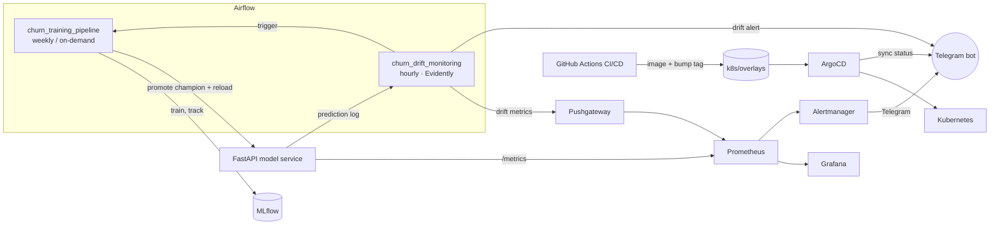

# 📉 Churn MLOps — End-to-End ML System (DDM501 Final Project)

[](https://github.com/your-org/churn-mlops/actions/workflows/ci.yml)
[](https://github.com/your-org/churn-mlops/actions/workflows/cd.yml)
 
 
-EF7B4D) 

Predict which telecom customers will churn, explain *why*, serve the model behind a monitored API, and
keep it healthy in production: **Airflow DAGs** (train + drift), **Evidently** drift detection,
**Prometheus/Grafana** monitoring, **Telegram** alerts, **GitHub Actions** CI and **ArgoCD** GitOps CD.

| | |
|---|---|
| Dataset | IBM Telco Customer Churn (7 043 customers, 26.5 % churn) — auto-downloaded, synthetic fallback offline |
| Best model | XGBoost — hold-out ROC-AUC **0.847**, recall **0.80**, PR-AUC 0.66 (5-fold CV AUC 0.850) |
| Tests | 60 tests (unit / integration / data-quality / model), **94 % coverage**, gate ≥ 80 % |

## Architecture (short)


Full design, data flow and trade-offs: **[ARCHITECTURE.md](ARCHITECTURE.md)**.

## Quick start (local, 5 minutes)

```bash
git clone https://github.com/your-org/churn-mlops && cd churn-mlops
cp .env.example .env                  # add TELEGRAM_BOT_TOKEN / TELEGRAM_CHAT_ID (optional)
pip install -r requirements-dev.txt

make pipeline                         # ingest → validate → train (3 models, CV) → gate → promote → fairness → SHAP/LIME
make test                             # 60 tests + coverage gate
make api                              # http://localhost:8000/docs  (Swagger / OpenAPI)
```

### Full stack with Docker Compose

```bash
make up                               # API, MLflow, Airflow, Prometheus, Pushgateway, Alertmanager, Grafana
make bootstrap                        # (once) train a champion so /ready turns green  — or trigger the DAG in Airflow
```

| Service | URL | Login |
|---|---|---|
| API + Swagger | http://localhost:8000/docs | – |
| Airflow | http://localhost:8085 | admin / `AIRFLOW_ADMIN_PASSWORD` (default `admin`) |
| MLflow | http://localhost:5000 | – |
| MinIO Console | http://localhost:9001 | `MINIO_ROOT_USER` / `MINIO_ROOT_PASSWORD` (default `minioadmin` / `minioadmin`) |
| MinIO S3 API | http://localhost:9000 | – |
| Grafana | http://localhost:3000 | admin / `GRAFANA_PASSWORD` (dashboard *Churn MLOps — Serving & Model Health*) |
| Prometheus / Alertmanager | http://localhost:9090 / :9093 | – |

#### MinIO Object Storage Buckets:
- `s3://mlflow/`: Stores MLflow experiment runs, candidate model packages, and metric plots.
- `s3://churn-data/`: Stores raw dataset (`raw/telco_churn.csv`) and processed splits (`processed/train.csv`, `processed/test.csv`).
- `s3://churn-reports/`: Stores Evidently drift reports (HTML/JSON), Fairlearn fairness audits, SHAP/LIME explainability plots (`shap_summary.png`, `shap_importance.png`, `explainability.json`).
- `s3://churn-artifacts/`: Stores production champion model bundles (`model.joblib`, `metadata.json`, `reference.csv`) and gate decision results.


### 2-minute demo of the drift → alert → retrain loop

```bash
make traffic            # 300 normal requests  → Evidently: no drift (≈16 % of columns drift by chance)
make traffic-drift      # 300 shifted requests → Evidently: drift (≈37 %) → Telegram alert → retraining DAG
```
Open the Evidently report: `artifacts/reports/drift_report.html`.

## Telegram alerting

1. Talk to **@BotFather** → `/newbot` → copy the token. Add the bot to your group, send a message, then open
   `https://api.telegram.org/bot<TOKEN>/getUpdates` to read `chat.id` (negative for groups).
2. Put both in `.env` (Compose), in GitHub *Secrets* (`TELEGRAM_BOT_TOKEN`, `TELEGRAM_CHAT_ID`) and in the ArgoCD notifications secret.

Three independent alert paths all land in the same chat:

| Source | Examples |
|---|---|
| Prometheus → Alertmanager (`monitoring/alert_rules.yml`) | API down, 5xx > 5 %, p95 > 500 ms, model not loaded, drift share > 50 %, churn-rate anomaly, model stale, AUC < 0.75 |
| Airflow / Evidently (`churn.notify`) | Task failures, data-validation failures, **data drift detected**, model promoted / rejected |
| ArgoCD Notifications + GitHub CD | Sync succeeded / failed, degraded health, deployment done |

## GitOps CD with ArgoCD

```
push main ──► CI (lint · tests · DAG check · manifests · docker smoke)
          └─► CD: train → build image → push GHCR → bump  k8s/overlays/dev   ─► ArgoCD auto-sync → namespace churn-dev
tag v1.2.0 ─► CD: …same…                               bump  k8s/overlays/prod ─► ArgoCD auto-sync → namespace churn
```
```bash
kubectl apply -n argocd -f argocd/project.yaml -f argocd/application-dev.yaml -f argocd/application-prod.yaml
kubectl apply -n argocd -f argocd/notifications-cm.yaml     # after creating argocd-notifications-secret
```
Replace `your-org` in `k8s/overlays/*/kustomization.yaml`, `argocd/*.yaml`, `Dockerfile` with your GitHub org.
Rollback = `git revert` the bump commit (ArgoCD `selfHeal` converges the cluster).

## Repository layout

```
src/churn/        data · features · train · evaluate (gate) · fairness · explain · drift · notify · cli
src/api/          FastAPI service (schemas, Prometheus metrics, SHAP endpoint, hot-reload)
airflow/dags/     churn_training_pipeline.py · churn_drift_monitoring.py
monitoring/       prometheus.yml · alert_rules.yml · alertmanager.yml · grafana dashboards
k8s/ argocd/      Kustomize base + dev/prod overlays · ArgoCD Project/Applications/Notifications
.github/workflows ci.yml · cd.yml
tests/            unit · integration · data_quality · model
docs/             PROBLEM_DEFINITION · RESPONSIBLE_AI · USER_GUIDE · PRESENTATION_OUTLINE
```

## API example

```bash
curl -s localhost:8000/v1/predict -H 'content-type: application/json' -d @- <<'JSON'
{"SeniorCitizen":0,"Partner":"Yes","Dependents":"No","tenure":5,"PhoneService":"Yes","MultipleLines":"No",
 "InternetService":"Fiber optic","OnlineSecurity":"No","OnlineBackup":"No","DeviceProtection":"No",
 "TechSupport":"No","StreamingTV":"Yes","StreamingMovies":"Yes","Contract":"Month-to-month",
 "PaperlessBilling":"Yes","PaymentMethod":"Electronic check","MonthlyCharges":89.1,"TotalCharges":445.5}
JSON
# {"churn_probability":0.91,"churn":true,"risk_level":"high","model_version":"…","request_id":"…"}
```
`POST /v1/explain` returns the top SHAP contributions; `GET /v1/model` the deployed version/metrics.

## Troubleshooting

| Symptom | Fix |
|---|---|
| `/ready` returns 503 | No champion yet → `make bootstrap` or trigger `churn_training_pipeline` in Airflow, then `docker compose restart api` |
| Airflow tasks can't import `churn` | The repo must be mounted at `/opt/project` (compose does this); check `PROJECT_ROOT` |
| No Telegram messages | `docker compose logs alertmanager`; verify token/chat id; the bot must be a member of the group |
| Drift check says "Not enough production data" | Need ≥ 100 logged requests (`monitoring.min_current_rows`) → `make traffic` |
| Dataset download blocked | Pipeline falls back to synthetic data (`data.allow_synthetic_fallback`); place the CSV in `data/raw/telco_churn.csv` to use real data |
| ArgoCD stuck `OutOfSync` | `argocd app diff churn-api-dev`; make sure the repo URL/branch in `argocd/*.yaml` is yours |

## Verification status (be honest in the demo)

| Verified in development | Needs your cluster / accounts |
|---|---|
| Full pipeline run, 60 tests (94 %), ruff, mypy | `docker compose up` on your machine (images not built in the authoring sandbox) |
| Both Airflow DAGs import cleanly in Airflow 2.9.3 | Airflow UI run of the DAGs end-to-end |
| Live API → Evidently drift demo (16 % vs 37 %) | Grafana dashboard rendering, Alertmanager → Telegram delivery |
| `kustomize build` for dev and prod overlays | ArgoCD sync on a real cluster |
